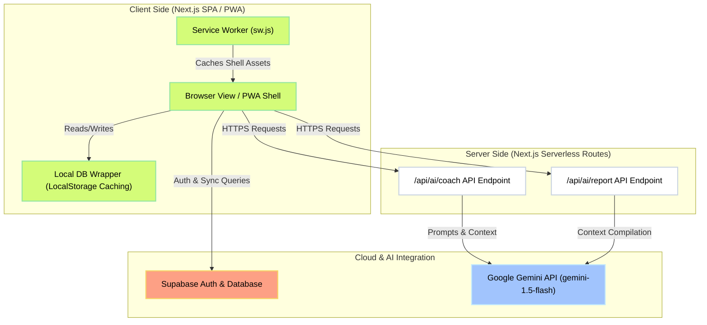
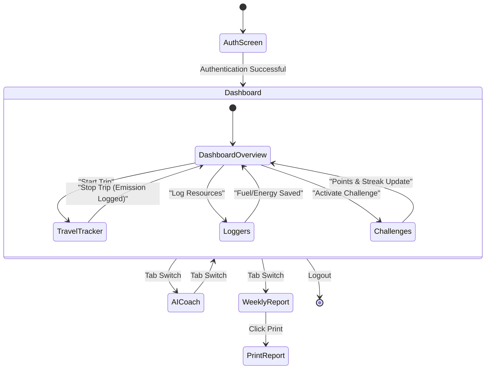
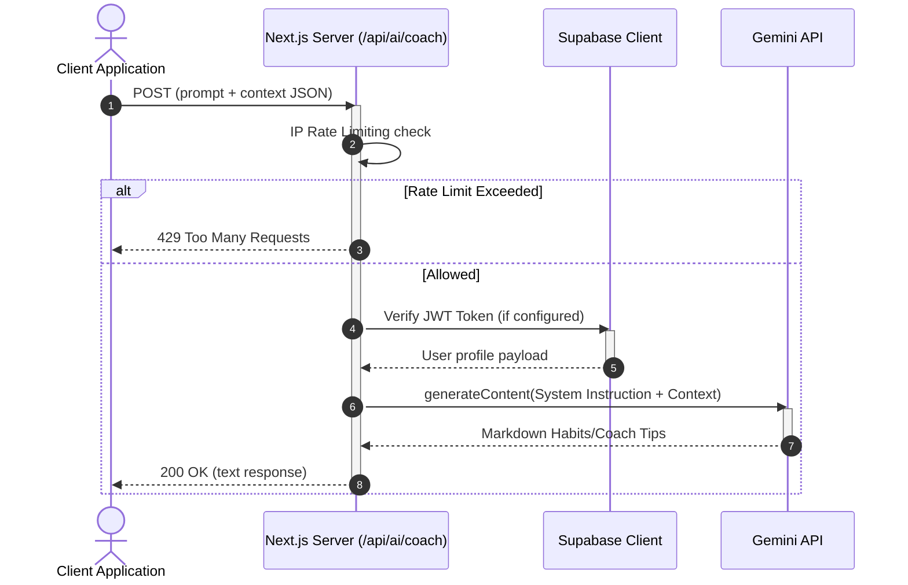

# EcoBuddy AI — System Architecture Documentation

This document outlines the high-level architecture, subsystem designs, data flows, offline-first fallback strategies, and security schemas for **EcoBuddy AI**. Written by the Core Architecture Team, it is designed for PromptWars evaluation and hackathon compliance audits.

---

## 1. System Overview

EcoBuddy AI is an offline-first, mobile-responsive Progressive Web Application (PWA) designed to gamify and track daily sustainability habits. It enables users to compute travel carbon footprints (with GPS tracking), log resource refuels (fuel and electricity grid metrics), engage in streaks and achievements, and consult an AI Sustainability Coach (powered by Google Gemini API).

### Architectural Philosophy
1. **Low Friction (Zero-Configuration Launch)**: The application detects the lack of backend environment variables and transitions seamlessly to client-side localStorage simulation mode (Developer Sandbox Mode).
2. **Offline-First Design**: Local caches ensure data is readable and writable without active internet connection, synchronizing with Supabase when connectivity resolves.
3. **Privacy-Preserving**: All calculations run locally in the calculations module; third-party AI interfaces receive only anonymous aggregates.

---

## 2. High-Level Architecture

The system is constructed as a decoupled, serverless Next.js 15 application utilizing:
- **Presentation Layer**: Client-side React 19 pages with Framer Motion animations and Recharts analytics.
- **Service Tier**: Client-side DB Manager (`src/lib/db.ts`) handles caching, CRUD routing, and Supabase interaction.
- **Server Tier**: Next.js Server Actions and API Routes executing IP rate-limiting, authentication token verification, and Gemini generative requests.
- **BaaS (Backend-as-a-Service)**: Supabase PostgreSQL database instances configured with Row-Level Security (RLS) tables.



---

## 3. User Interaction Flow

Users traverse the app via a responsive layout wrapper. The main state coordinates views, synchronization cues, and system theme.



---

## 4. Authentication Flow

Authentication is managed dynamically:
- **Cloud Mode**: Next-generation JWT email/password validation against Supabase Auth schemas. Session keys are stored client-side in cookies/localStorage.
- **Sandbox Mode**: When URL environment variables are absent, local storage acts as a mock authentication vault. A default mock profile (Alex Green / Eco Explorer) is immediately initialized to provide immediate, CRUD-capable access.

---

## 5. Carbon Tracking Flow

Carbon tracking is the logical core of the application. Raw inputs are processed using standard carbon factors before write commits:

```mermaid
flowchart TD
    classDef input fill:#e0f2fe,stroke:#38bdf8,stroke-width:2px,color:#000
    classDef logic fill:#f0fdf4,stroke:#4ade80,stroke-width:2px,color:#000
    classDef store fill:#fef2f2,stroke:#f87171,stroke-width:2px,color:#000

    A["User Inputs (Trip, Fuel, Energy)"]:::input --> B["calculations.ts Formulas"]:::logic
    B -->|Carbon Emitted (kg CO2)| C["db.ts Client Manager"]:::logic
    C -->|isSupabaseConfigured = true| D["Supabase Postgres Tables"]:::store
    C -->|isSupabaseConfigured = false| E["LocalStorage Caches"]:::store
    D & E --> F["DashboardView Trend Graphs"]:::input
    D & E --> G["Daily Carbon Score (0-100)"]:::logic
```

---

## 6. Travel Geolocation & Tracking

The Smart Travel Tracker tracks paths using the HTML5 Geolocation API:
1. **Start Trip**: Captures initial coordinates, initializes the active trip state machine, and stores a pending record marked `active = true`.
2. **Path Updates**: Periodically queries current latitude/longitude coordinates to trace active routes. A Developer Routing Simulator is provided for sandbox testing.
3. **Stop Trip**: Captures final coordinates, stops geographic tracking, computes total distance traveled (Haversine formula), and converts the distance to emissions using the calculations module before saving the final trip entry.

---

## 7. Fuel Logging Flow

Users log gas refuels to compute the carbon footprint of vehicles:
- **Inputs**: Litres purchased, fuel type (petrol or diesel), and current vehicle mileage.
- **Execution**: Computes total footprint using factors:
  - Petrol: $2.31 \text{ kg } CO_2\text{/L}$
  - Diesel: $2.68 \text{ kg } CO_2\text{/L}$
- **Database Write**: Appends log to the `fuel_records` collection, updating the user's daily totals.

---

## 8. Electricity Grid Logging Flow

Energy tracking parses local utility usage:
- **Inputs**: Grid electricity consumed in Kilowatt-hours (kWh), calendar month, and optionally a picture of the utility bill.
- **Simulation Scanner**: Snapping a bill image triggers a mock OCR animation. A CSS-layered scanner bar sweeps down for 3 seconds, after which a mock reader returns computed consumption figures.
- **Footprint conversion**: Computes footprint using grid factor $0.85 \text{ kg } CO_2\text{/kWh}$.

---

## 9. AI Coach Flow

The AI Coach coordinates user context with the Gemini language models:



---

## 10. Weekly Report Generation Flow

Weekly report compilation consolidates user database records into static audit summaries:
- **Query Compilation**: Resolves all trips, fuel logs, and grid entries recorded over the past 7 days.
- **Server Action**: POSTs dataset to `/api/ai/report`. 
- **AI Processing**: Gemini structures a summary containing:
  - Categorized footprint breakdown.
  - Success streak milestones.
  - AI Action Plan (with exact custom goals).
- **Print Optimization**: Rendered using a printer-friendly stylesheet that strips app navigation layers for PDF conversion.

---

## 11. Supabase Integration

When credentials are configured, the database manager transitions to cloud mode. The Supabase client establishes a PostgreSQL connection using the following schema layouts:
- `profiles`: User information, streak trackers, points totals, and current goals.
- `trips`: GPS logs, transport modes, and travel footprint weights.
- `fuel_records`: Gas logging logs.
- `electricity_records`: Grid consumption entries and bill references.
- `carbon_scores`: Aggregated daily scores.
- `user_challenges` & `user_achievements`: Trackers for completed challenges and unlocked achievements.

---

## 12. Offline LocalStorage Fallback

The localStorage fallback ensures zero-configuration ease of evaluation. Cache mappings include:
- `eb_profile`: User profile state.
- `eb_trips`: Active and completed trip arrays.
- `eb_fuel_records` & `eb_electricity_records`: Resource history.
- `eb_carbon_scores`: Computed score records.
- `eb_challenges` & `eb_achievements`: Status trackers.

Helper modules `getLocal(key, fallback)` and `setLocal(key, value)` handle serialization and fail silently if storage bounds are hit.

---

## 13. Database Sync Architecture

When transitioning from offline Developer Sandbox Mode to Supabase Cloud, or when signing in, the client mounts a session-recovery thread:
1. **Detect Cloud Config**: Confirms `isSupabaseConfigured` is active.
2. **Recover Remote Session**: Queries Supabase Auth (`supabase.auth.getSession()`).
3. **Local Cache Flushing**: If local cache data exists, it prompts user confirmation to upload offline logs to remote tables before clearing local caches.

---

## 14. Security Architecture

EcoBuddy AI enforces standard security guidelines:
- **Row-Level Security (RLS)**: PostgreSQL tables are protected with strict RLS policies. Read and write actions are filtered by `auth.uid() = user_id`.
- **Environment Isolation**: API endpoints securely fetch Gemini API Keys using server-only process blocks (`process.env.GEMINI_API_KEY`), keeping keys safe from client exposure.
- **Rate-Limiting Protection**: API routes implement sliding-window rate limit maps to defend endpoints against brute-force calls.

---

## 15. PWA Architecture

EcoBuddy AI is structured as an installable Progressive Web Application:
- **Manifest**: Built via dynamic dynamic layout routing (`src/app/manifest.ts`) to configure themes, icons (`icon-192.png`, `icon-512.png`), and display states.
- **Service Worker (`public/sw.js`)**: Registers cache blocks to serve critical app bundles, stylesheets, and local routes offline.

---

## 16. Deployment Architecture

EcoBuddy AI is optimized for cloud deployment:
- **Edge Compilation**: Next.js source code is hosted on **Vercel** serverless environments for high-speed page loads.
- **BaaS Cluster**: Supabase databases are provisioned on AWS clusters.
- **CI/CD Integration**: Commits to main branches trigger automatic Vercel compilation, running type validations, linting, and build optimization sweeps.
