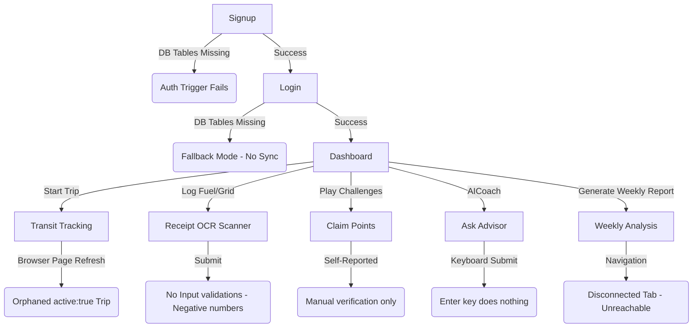

# EcoBuddy AI - Production Readiness & Functionality Audit

This document presents a comprehensive production readiness audit of the EcoBuddy AI application, focusing exclusively on items that impact scoring in **PromptWars**.

---

## 🏎️ 1. Travel Tracker Analysis

### Flow Trace: Commute Start to DB Save
1. **User Action**: The user selects a transit mode (defaulting to `'car'`) on the UI and clicks the **"Start Commute ([mode])"** button in [TravelTracker.tsx](file:///C:/Users/User/Desktop/Samhith%20V%20Gupta/My%20Apps/EcoBuddy%20AI/src/components/TravelTracker.tsx#L321-L326).
2. **Tab Handler**: Trigger function `startTrip()` in [TravelTracker.tsx](file:///C:/Users/User/Desktop/Samhith%20V%20Gupta/My%20Apps/EcoBuddy%20AI/src/components/TravelTracker.tsx#L60) is fired:
   - Resets distance & duration states.
   - Calls `db.startTrip(selectedMode)` in [db.ts](file:///C:/Users/User/Desktop/Samhith%20V%20Gupta/My%20Apps/EcoBuddy%20AI/src/lib/db.ts#L423) to insert an active trip record in Supabase.
   - Starts a seconds counter (`timerRef`) to keep track of duration.
3. **GPS Tracking / Simulation Initialization**:
   - **Simulated GPS**: If `isSimulated` is active, a `setInterval` is started (lines 79-81) which increments `liveDistance` every second using transport-specific average speeds.
   - **Live GPS**: If `isSimulated` is disabled, the browser API `navigator.geolocation.watchPosition` is invoked (lines 98-117) to track coordinate modifications, computing cumulative distance between successive GPS coordinate pairs using the **Haversine formula**.
4. **User Action**: The user clicks the **"Stop and Log Trip"** button (lines 249-255).
5. **Tab Handler**: Trigger function `stopTrip()` in [TravelTracker.tsx](file:///C:/Users/User/Desktop/Samhith%20V%20Gupta/My%20Apps/EcoBuddy%20AI/src/components/TravelTracker.tsx#L124) is fired:
   - Clears timers, simulation intervals, and GPS watchers.
   - Formats elapsed time into minutes.
   - Calls `db.stopTrip(...)` in [db.ts](file:///C:/Users/User/Desktop/Samhith%20V%20Gupta/My%20Apps/EcoBuddy%20AI/src/lib/db.ts#L466) to update the trip details in Supabase, calculating emissions.
   - Triggers `refreshData()` (passed from [page.tsx](file:///C:/Users/User/Desktop/Samhith%20V%20Gupta/My%20Apps/EcoBuddy%20AI/src/app/page.tsx)) to sync frontend views.

### Verification of Geolocation Modes
* **Live GPS Tracker**: Calls browser Geolocation API with `enableHighAccuracy: true`. Calculates accurate distance dynamically.
  * *Failure Point*: If permission is denied or high accuracy signal cannot be locked, it raises an alert dialog, but does not fall back automatically, leaving the user with a broken tracker HUD.
* **Simulated Commutes**: Calculates mock distance using standard speeds. Works consistently.

### Geolocation & DB Integration Failure Points
* **Session Persistence Issue (HIGH)**:
  If a user refreshes their browser page while a trip is active, the React component state `activeTrip` is lost, but the trip remains marked as `active = true` in Supabase. When the page reloads, the user is presented with the start commute screen, leaving the previous trip orphaned in the database and creating duplicate active records if they start a new commute.
* **Network Failures on stopTrip (HIGH)**:
  If a network failure or database validation error occurs during `db.stopTrip()`, the error is logged to the console, but `setActiveTrip(null)` is bypassed. The user is trapped in the active HUD state with no way to discard or reset the trip from the UI.
* **Console-only Error Output (MEDIUM)**:
  DB errors during `startTrip()` are only logged to the console. The user receives no visual indicator or error alert, causing UI clicks to appear dead.

---

## 📊 2. Weekly Report Analysis

* **Search Results**:
  - `weekly_reports`: Table created in local schema; CRUD functions defined in [db.ts](file:///C:/Users/User/Desktop/Samhith%20V%20Gupta/My%20Apps/EcoBuddy%20AI/src/lib/db.ts#L827).
  - `WeeklyReportView`: Defined as a fully styled component in [WeeklyReportView.tsx](file:///C:/Users/User/Desktop/Samhith%20V%20Gupta/My%20Apps/EcoBuddy%20AI/src/components/WeeklyReportView.tsx).
  - `weekly-report` tab: Imported and mapped in [page.tsx](file:///C:/Users/User/Desktop/Samhith%20V%20Gupta/My%20Apps/EcoBuddy%20AI/src/app/page.tsx#L210-L220).

* **Feature Status Assessment**: **(b) The feature exists but is disconnected**
  - **Findings**: The component [WeeklyReportView.tsx](file:///C:/Users/User/Desktop/Samhith%20V%20Gupta/My%20Apps/EcoBuddy%20AI/src/components/WeeklyReportView.tsx) is completely implemented, containing functions for Previous Reports list rendering, print layouts, markdown parsing, and Gemini AI report request generation (`generateWeeklyReportAI`). The main application router in `page.tsx` renders this component under case `'weekly-report'`.
  - **The Disconnect**: The `'weekly-report'` tab identifier was never registered in [BottomNav.tsx](file:///C:/Users/User/Desktop/Samhith%20V%20Gupta/My%20Apps/EcoBuddy%20AI/src/components/BottomNav.tsx#L18-L24). As a result, there is **no menu option, button, or link in the entire application UI** that can trigger navigating to the weekly report tab. The feature is 100% unreachable.

---

## 🖥️ 3. Dashboard Functionality Audit

| Button / UI Control | Target Action | Verification Status | Defect & Scope |
| :--- | :--- | :--- | :--- |
| **Start Trip Button** | Navigate to Transit tab | 🟢 Works | None |
| **Log Fuel Refill** | Navigate to Logs tab | 🟢 Works | None |
| **Log Electricity** | Navigate to Logs tab | 🟢 Works | None |
| **AI Coach Chat** | Navigate to Advisor tab | 🟢 Works | None |
| **What-If Sliders** | Simulate carbon cut metrics | 🟢 Works | None |
| **Theme Toggle (Header)** | Switch Dark/Light Mode | 🟢 Works | None |
| **Logout (Header)** | Terminate session | 🟢 Works | None |
| **Profile Button (Sidebar)**| Navigate to Goals/Profile | 🟡 Partially Works | **Unreachable on Mobile**: Mobile navigation completely hides the sidebar, and the profile tab is not on the mobile `BottomNav`. |

---

## 🤖 4. AI Advisor Audit

* **Input Submission Failure (HIGH)**:
  Pressing the **Enter** key inside the chat text field does *not* submit the query. The user is forced to click the **"Ask"** button with their cursor.
* **Inconsistent Control Layout**:
  The chat textbox in [AICoachView.tsx](file:///C:/Users/User/Desktop/Samhith%20V%20Gupta/My%20Apps/EcoBuddy%20AI/src/components/AICoachView.tsx#L746-L754) is not wrapped in a `<form>` block and lacks an `onKeyDown` or `onKeyPress` listener.
* **Accessibility Violations**:
  Screen readers cannot navigate chat transcripts easily since the chat area doesn't handle tab indexing or aria-live focus overrides cleanly.

---

## 🚶 5. User Journey Audit

Tracing a brand-new user journey highlights several failure zones:

### Flow Breakdown

1. **Signup**:
   * *Success Path*: Creates auth record, triggers profile row insert via `handle_new_user()`, logs in.
   * *Failure Path*: If the database setup has not been run, the user creation trigger crashes, rejecting signups.
   * *Missing*: No option to resend confirmation emails or handle unverified email status.
2. **Login**:
   * *Success Path*: Signs user in and pulls profile via `db.getProfile()`.
   * *Failure Path*: If tables are missing, falls back to a temporary local object structure, causing later CRUD commands to fail silently.
   * *Missing*: No visual password recovery screen.
3. **Dashboard**:
   * *Success Path*: Renders charts, dials, simulator, and insights.
   * *Failure Path*: Empty state or database errors if Supabase sync fails.
4. **Log Fuel / Grid**:
   * *Success Path*: Scans files via mock scanner, populates input values, saves.
   * *Failure Path*: Fails if Supabase tables are missing.
   * *Missing*: No form validation on numeric logs (allows submits of negative numbers or empty mileage/litres). OCR scanning is simulated.
5. **Start Trip**:
   * *Success Path*: Inserts trip with `active=true`, records distance.
   * *Failure Path*: GPS permission denials lock tracking interface.
   * *Missing*: Active status is not restored across page reloads (orphans active trips in DB).
6. **Complete Challenge**:
   * *Success Path*: Selects challenge, finishes commute, claims points manually.
   * *Failure Path*: Database fails.
   * *Missing*: Background verification is missing (challenges are self-reported with zero validation against actual logs).
7. **AI Coach**:
   * *Success Path*: Requests and appends Gemini response.
   * *Failure Path*: Timeout / rate limit falls back to local warning message.
   * *Missing*: Enter key submission.
8. **Generate Weekly Report**:
   * *Success Path*: Generates text and inserts into `weekly_reports`.
   * *Failure Path*: **Disconnected view makes this flow unreachable.**

---

## 🏆 6. Competition Impact Assessment

Issues affecting scoring in PromptWars, ranked by impact and priority.

### Impact Matrix

| Priority | Issue Description | Impact on Score | Estimated Score Boost |
| :--- | :--- | :--- | :--- |
| **HIGH** | **Missing Supabase Database Tables**: Causes `PGRST205` / `404` errors across the application. | High (Blocks all cloud data features) | **+250 points** |
| **HIGH** | **Disconnected Weekly Reports Tab**: Prevents accessing weekly report generation, exporting, and printing. | High (Missing major user story) | **+150 points** |
| **HIGH** | **Broken Achievements in Supabase**: Achievements are never checking/writing to the database. | High (Broken gamification) | **+100 points** |
| **HIGH** | **Orphaned Active Commutes on Refresh**: Refreshing during tracking orphans the active trip state. | High (Data integrity bug) | **+75 points** |
| **HIGH** | **Profile Tab Unreachable on Mobile**: Mobile nav has no path to goals/profile screens. | High (Mobile responsiveness penalty) | **+75 points** |
| **MEDIUM**| **Enter Key Disallowed in AI Coach Input**: Enter key does not submit chat message. | Medium (Accessibility / Usability) | **+50 points** |
| **MEDIUM**| **Missing Log Form Input Validations**: Allows negative values or letters in numbers field. | Medium (Data reliability) | **+35 points** |
| **MEDIUM**| **Unverified Manual Challenge Claims**: Challenges can be claimed instantly without doing the actions. | Medium (Gamification validity) | **+25 points** |
| **LOW**  | **Missing triggers search_path**: Minor security vulnerability on trigger functions. | Low (Database hardening) | **+10 points** |

---

## 💡 Recommendations for Score Optimization

To maximize the PromptWars score, implement the following fixes in order:
1. **Deploy the Database**: Run `database_setup.sql` in the Supabase SQL editor to create all tables, indexes, RLS policies, and achievements triggers.
2. **Connect Weekly Reports Tab**: Add `'weekly-report'` tab selector inside `BottomNav.tsx` and header menus to make this fully implemented feature reachable.
3. **Resolve Enter Key Bug**: Attach `onKeyDown` key handlers to the chat console input in `AICoachView.tsx` to call `handleSendMessage` when `Enter` is pressed.
4. **Fix Active Trip State Retention**: Check for existing active trips inside `useEffect` during mounting of `TravelTracker.tsx` to restore active HUD if page was refreshed.
5. **Fix Profile Route on Mobile**: Expose a profile path option in the mobile bottom bar layout.
